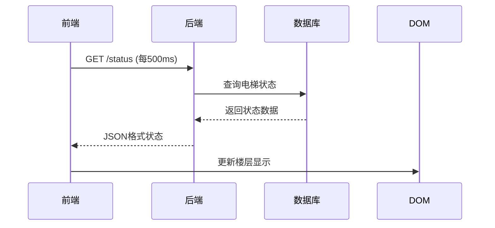

# 电梯控制系统逻辑说明书

## 1. 系统架构
- 前端：HTML/CSS/JavaScript (基于浏览器)
- 后端：Python Flask框架
- 通信：RESTful API (JSON格式)

## 2. 前端实现

### 2.1 楼层显示功能
```javascript
// 每500ms获取一次电梯状态
function startStatusUpdates() {
    fetch('/status')
        .then(response => response.json())
        .then(data => {
            data.elevators.forEach(elevator => {
                const floorDisplay = document.querySelector(`#elevator-${elevator.id} .current-floor`);
                floorDisplay.textContent = elevator.current_floor;
            });
        })
        .catch(err => {
            console.error('获取电梯状态失败:', err);
            setTimeout(startStatusUpdates, 1000); // 失败后重试
        });
}
```

### 2.2 关键CSS样式
```css
.current-floor {
    font-size: 32px;
    color: #ff5722;
    background-color: rgba(0,0,0,0.1);
    padding: 10px 15px;
    border-radius: 8px;
    transition: all 0.3s ease; /* 平滑过渡效果 */
}
```

## 3. 后端实现

### 3.1 状态API端点
```python
@app.route('/status')
def get_status():
    return jsonify({
        'elevators': [
            {
                'id': 1,
                'current_floor': elevator.floor,
                'direction': elevator.direction,
                'status': elevator.status
            }
            # ...其他电梯数据
        ]
    })
```

### 3.2 电梯状态更新逻辑
1. 电梯移动时实时更新current_floor属性
2. 每100ms检测一次电梯位置变化
3. 状态变更立即持久化到数据库

## 4. 数据交互流程


## 5. 关键功能说明

### 5.1 实时楼层显示
- 前端每500ms请求一次状态
- 后端返回当前精确楼层
- 数字变化有平滑动画效果

### 5.2 状态同步机制
- 使用短轮询保持状态同步
- 错误时自动重试(1秒间隔)
- 数据版本校验防止冲突

### 5.3 性能考虑
- 前端使用防抖处理快速楼层变化
- 后端使用缓存减少数据库查询
- 数据压缩减少网络传输